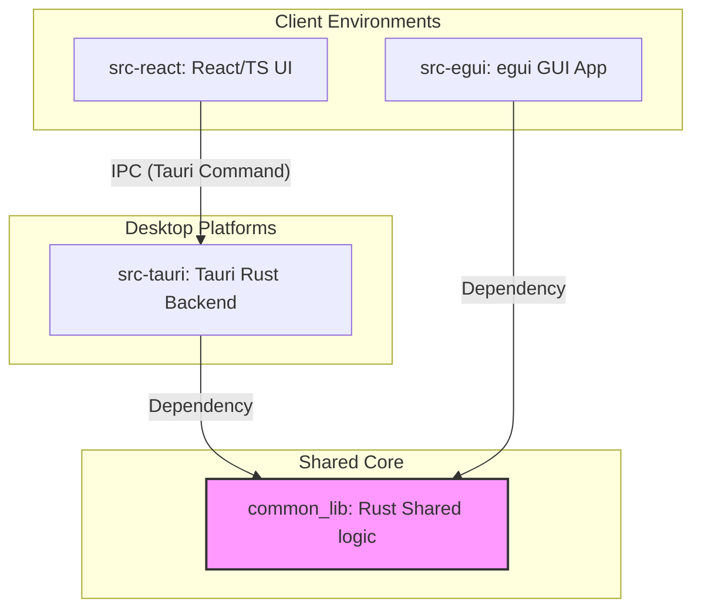
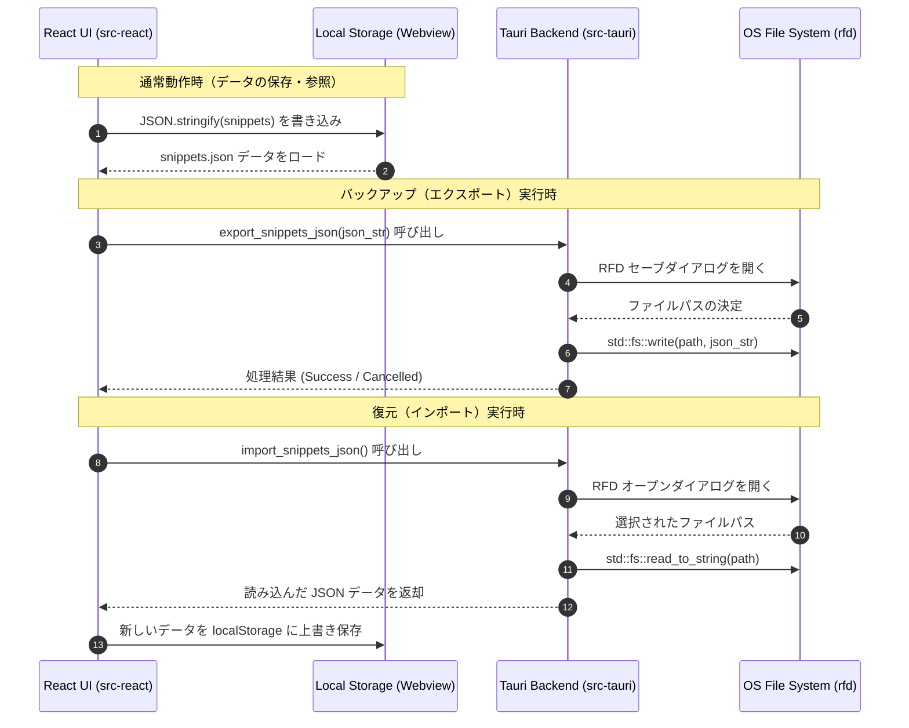
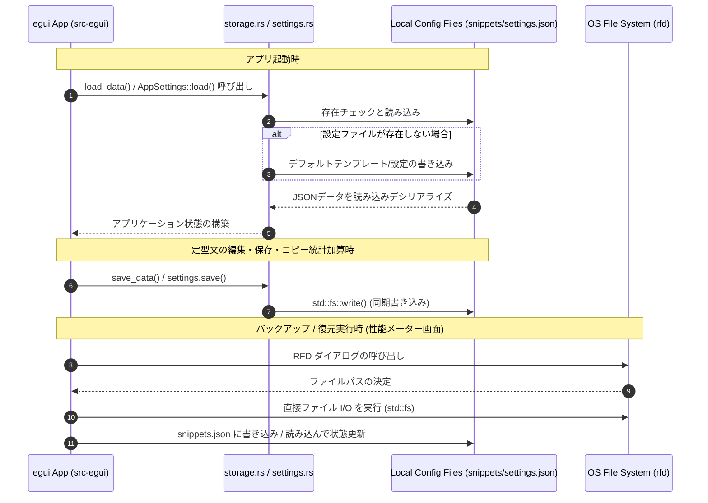

# システムアーキテクチャ設計書 (ARCHITECTURE.md)

本ドキュメントは、「定型文クリップボード・マネージャー (SnippetFlow)」のシステム構造、ハイブリッド動作環境における設計思想、コンポーネント間の境界、およびデータフロー・永続化設計について定義します。

---

## 1. システムの概要と目的

### 1.1. 概要
SnippetFlowは、日常のビジネスメールや定型業務で多用される定型テキスト（挨拶文、日程調整、謝罪文、PRテンプレート等）をローカル環境で安全に蓄積し、必要なときに瞬時に呼び出してクリップボードにコピーできる超軽量デスクトップ・ユーティリティです。

### 1.2. 目的
- **業務効率化**: 数クリックまたはショートカット操作で定型文を選択・結合・差分比較し、クリップボード経由で任意のアプリケーションに貼り付け可能にする。
- **データプライバシーの確保**: クラウドサーバーを介さず、すべての定型文データや設定情報をユーザーのローカルディスクにのみ保存する。
- **低リソース動作の追求**: バックグラウンドでの常時起動を想定し、CPU・メモリ消費を極限まで抑えたネイティブ動作を実現する。

---

## 2. 技術スタック

本プロジェクトは、適材適所で技術を使い分けるためにハイブリッド構成を採用しています。

### 2.1. 共通コア言語
- **Rust**: 高いパフォーマンス、メモリ安全性、低フットプリントを実現するバックエンドおよび単体デスクトップアプリ用言語。
- **TypeScript / JavaScript**: フロントエンドUIロジックおよび型安全性の確保。

### 2.2. アプリケーション別フレームワーク＆ライブラリ
| 分類 | Tauri / Web版 (リッチUI) | egui版 (超軽量ネイティブ) |
| :--- | :--- | :--- |
| **GUIフレームワーク** | **Tauri v2** + **Vite 6** + **React 19** | **egui / eframe** (v0.22.0) |
| **言語・実行環境** | TS (React) / Rust (Tauri Backend) | 純Rust (Windows ネイティブ描画) |
| **スタイリング** | TailwindCSS v4 / Vanilla CSS | eguiカスタムテーマ (カスタムフレーム) |
| **クリップボードI/O** | `navigator.clipboard` / 簡易フォールバック | `arboard` (v3.2) |
| **シリアライズ** | `JSON.stringify` / `parse` | `serde` (v1.0) / `serde_json` (v1.0) |
| **日付・時刻** | `new Date().toISOString()` | `chrono` (v0.4) |
| **ダイアログI/O** | `rfd` (v0.12) ※Tauri Rust側で仲介 | `rfd` (v0.12) |
| **アイコン** | `lucide-react` | プレーンテキスト/Unicode絵文字 |

---

## 3. アーキテクチャ・ディレクトリ構造の意図

プロジェクトは以下のように整理されており、Web技術による生産性とRustによる高性能・低フットプリントという双方の強みを活かせるように設計されています。

```text
SnippetFlow/
├── .agents/             # エージェント用指示書（AGENTS.md等）の配置
├── common_lib/          # 両実行環境で共通して使用するRust共有ライブラリ
├── docs/                # 仕様書、アーキテクチャ、リリース手順等のドキュメント類
├── src-egui/            # egui版（純Rust）のソースコード
├── src-react/           # Tauri版のフロントエンド（React/TypeScript）ソースコード
└── src-tauri/           # Tauri版のデスクトップアプリバックエンド（Rust）ソースコード
```

### 3.1. 各ディレクトリの役割と詳細
- **`src-react/` (Vite / React UI)**:
  - リッチなUI表現、スムーズなアニメーション、および快適なUXを提供する役割を持ちます。
  - `components/` にて各画面（一覧、フォーム、マージ、比較、性能診断）をコンポーネント化し、状態管理はカスタムフック `hooks/useSnippets.ts` に集約しています。
- **`src-tauri/` (Tauri Rust Backend)**:
  - Webview（React側）から要求されたOS固有の機能（ネイティブファイルダイアログによるインポート/エクスポート等）を安全に実行するブリッジとしての役割を持ちます。
- **`src-egui/` (純Rust GUI App)**:
  - Webviewエンジンすら起動させない「極限の低リソース」で動作する実行環境です。
  - Windows環境での常時最前面・低リソースユーティリティとしての品質を保証するため、即時モード描画（Immediate Mode）のレンダリング頻度を制限し、アイドルCPU使用率 0.0%〜0.1% を達成しています。
- **`common_lib/` (共通ロジッククレート)**:
  - フロントエンドと言語を越えて、完全に同一の動作を保証すべき「アルゴリズム」や「スコアリング」を共通Rustコードとして一元管理します。
  - これにより、二重実装によるバグの混入を防ぎ、テスト容易性を高めています。

---

## 4. データフローと主要モジュール間の連携

### 4.1. モジュール構成と依存関係
アプリケーションは、共有アルゴリズムを格納した `common_lib` をコアとして、以下のように依存し合っています。



### 4.2. Tauri版（React/TS + Rust）のデータフロー
Tauri版では、通常時の定型文データの保存やテーマ設定の永続化はブラウザの `localStorage` で完結します。
OSのネイティブ機能（ファイルダイアログ）を用いたバックアップ（エクスポート）および復元（インポート）の処理時のみ、TauriのIPC（Tauri Command）を介してRustバックエンドへ一時的にデータを渡し、Rust側が `rfd` ダイアログを呼んでローカルファイルへ直接書き込み・読み込みを行います。



### 4.3. egui版（純Rust）のデータフロー
egui版では、すべての処理がRustのネイティブスレッド内で動作します。
起動時にローカルのカレントディレクトリから `snippets.json` および `settings.json` をロードします。もしファイルが存在しない場合は、組み込まれた初期テンプレートデータを自動生成してファイル保存します。
データのインポートおよびエクスポートも、UIイベントをトリガーにRust内の `rfd` クレートを呼び出して直接ファイルをI/Oします。



---

## 5. 共有ロジック（`common_lib`）のアルゴリズム詳細

### 5.1. LCS (最長共通部分列) 差分計算
`common_lib` は差分比較機能の核となる LCS アルゴリズムを含んでいます。テキストAとテキストBを文字単位・行単位で比較し、同一の最長部分シーケンスを決定します。
動的計画法（DP）テーブルを構築し、そこからバックトラックを行うことで、追加されたテキスト（Green）と削除されたテキスト（Red）を最小限の差分として検出し、UI側に返します。

### 5.2. インテリジェント・タグ提案
定型文の新規追加や編集の際、入力中の「タイトル」「本文」「説明」に含まれる単語を形態素レベルに分類し（※軽量化のため単語の出現頻度カウントをベースとした処理）、既存のデータベースにある全タグとの関連度を算出します。
- **算出式**:
  各既存タグについて、入力中テキスト内に該当タグそのもの、または関連キーワードが含まれる回数を算出。
  $$Score = (TitleMatches \times 2) + ContentMatches + DescriptionMatches$$
  このスコアが一定値以上のタグのうち、まだ付与されていないものを最大5つ提案します。
