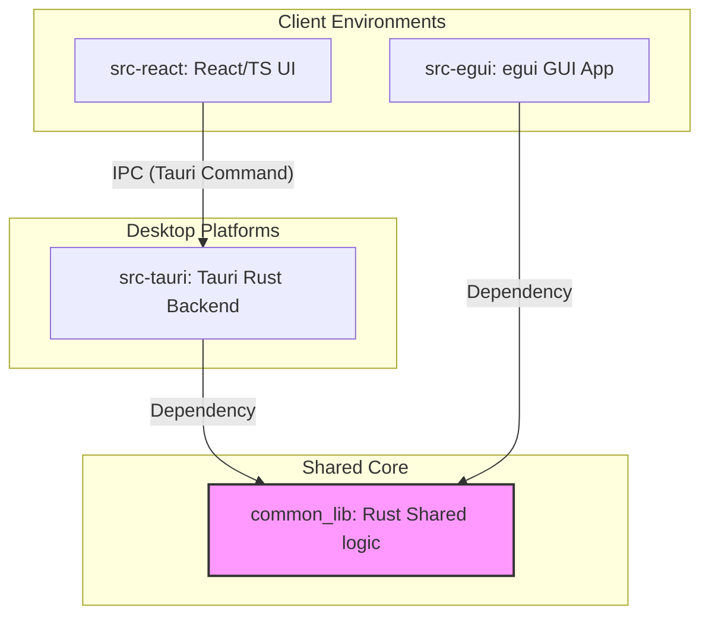
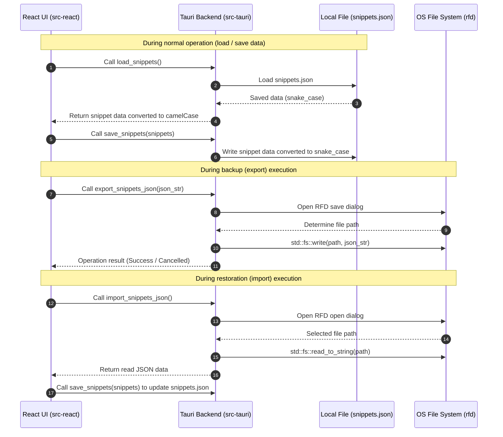
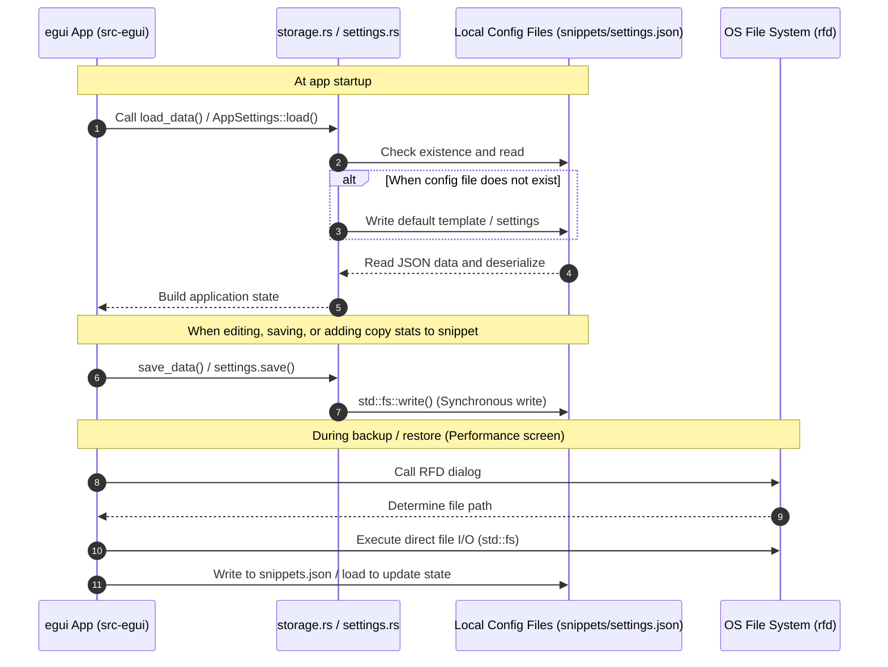

**English** | [日本語版](../ja/ARCHITECTURE.md)

# System Architecture Design Document (ARCHITECTURE.md)

This document defines the system structure, design philosophy in the hybrid execution environment, boundaries between components, and data flow / persistence design for the "Snippet Clipboard Manager (SnippetFlow)".

---

## 1. System Overview and Purpose

### 1.1. Overview
SnippetFlow is an ultra-lightweight desktop utility that safely stores canned texts (greetings, scheduling, apologies, PR templates, etc.) frequently used in daily business emails and routine operations in the local environment, and allows users to instantly recall and copy them to the clipboard when needed.

### 1.2. Purpose
- **Operational Efficiency**: Select, combine, and compare snippets with a few clicks or shortcut keys, and paste them into any application via the clipboard.
- **Ensuring Data Privacy**: Store all snippet data and configuration information only on the user's local disk without going through any cloud server.
- **Pursuing Low-Resource Operation**: Assume background execution at all times, achieving native operation with extremely low CPU and memory consumption.

---

## 2. Technology Stack

This project adopts a hybrid configuration to use the right technology for the right job.

### 2.1. Common Core Language
- **Rust**: A backend and standalone desktop app language that delivers high performance, memory safety, and a low footprint.
- **TypeScript / JavaScript**: Ensuring frontend UI logic and type safety.

### 2.2. Frameworks & Libraries by Application
| Category | Tauri / Web Version (Rich UI) | egui Version (Ultra-lightweight Native) |
| :--- | :--- | :--- |
| **GUI Framework** | **Tauri v2** + **Vite 6** + **React 19** | **egui / eframe** (v0.22.0) |
| **Language / Runtime** | TS (React) / Rust (Tauri Backend) | Pure Rust (Windows native rendering) |
| **Styling** | TailwindCSS v4 / Vanilla CSS | egui custom theme (custom frame) |
| **Clipboard I/O** | `navigator.clipboard` / simple fallback | `arboard` (v3.2) |
| **Serialization** | `JSON.stringify` / `parse` | `serde` (v1.0) / `serde_json` (v1.0) |
| **Date & Time** | `new Date().toISOString()` | `chrono` (v0.4) |
| **Dialog I/O** | `rfd` (v0.12) *mediated on Tauri Rust side | `rfd` (v0.12) |
| **Icons** | `lucide-react` | Plain text / Unicode emojis |

---

## 3. Architecture & Directory Structure Design Intent

The project is organized as follows, designed to leverage the productivity of Web technologies and the high performance and low footprint of Rust.

```text
SnippetFlow/
├── .agents/             # Agent instructions (AGENTS.md, etc.)
├── common_lib/          # Rust shared library used across both execution environments
├── docs/                # Specifications, architecture, release procedures, and other documents
├── src-egui/            # Source code for the egui version (pure Rust)
├── src-react/           # Frontend (React/TypeScript) source code for the Tauri version
└── src-tauri/           # Desktop app backend (Rust) source code for the Tauri version
```

### 3.1. Roles and Details of Each Directory
- **`src-react/` (Vite / React UI)**:
  - Responsible for providing rich UI expressions, smooth animations, and a comfortable UX.
  - Components representing each screen (list, form, merge, comparison, performance diagnostics) are modularized in `components/`, and state management is centralized in the custom hook `hooks/useSnippets.ts`.
- **`src-tauri/` (Tauri Rust Backend)**:
  - Serves as a bridge to safely execute OS-specific functions (such as import/export using native file dialogs) requested by the Webview (React side).
- **`src-egui/` (Pure Rust GUI App)**:
  - An execution environment that runs with "extreme low resources" without even launching the Webview engine.
  - To guarantee the quality of a low-resource utility that is always on top in the Windows environment, it limits the rendering frequency of the immediate-mode GUI, achieving an idle CPU usage of 0.0% to 0.1%.
- **`common_lib/` (Shared Logic Crate)**:
  - Centralizes "algorithms" and "scoring" in shared Rust code to guarantee completely identical behavior across frontends and languages.
  - This prevents bugs caused by duplicate implementations and improves testability.

---

## 4. Data Flow and Inter-Module Collaboration

### 4.1. Module Configuration and Dependencies
The application dependencies are configured as follows, with `common_lib` containing the shared algorithms at its core.



### 4.2. Tauri Version (React/TS + Rust) Data Flow
In the Tauri version, the `load_snippets` command of the Rust backend is invoked via Tauri's IPC (Tauri Command) at startup to load data from `snippets.json` in the current directory.
Similarly, when saving data, the Rust backend writes to the local `snippets.json` through the `save_snippets` command. This shares and synchronizes the exact same data file with the egui version in real time.
Persistence of theme settings is currently completed within the browser's `localStorage` (planned to be centralized in `settings.json` in the future).



### 4.3. egui Version (Pure Rust) Data Flow
In the egui version, all processing runs within the native threads of Rust.
At startup, it loads `snippets.json` and `settings.json` from the local current directory. If the files do not exist, it automatically generates default template data and saves it.
File I/O for importing and exporting data is also triggered by UI events, invoking the `rfd` crate directly within Rust.



---

## 5. Shared Logic (`common_lib`) Algorithm Details

### 5.1. LCS (Longest Common Subsequence) Difference Calculation
`common_lib` contains the LCS algorithm, which is the core of the difference comparison feature. It compares Text A and Text B on a character-by-character or line-by-line basis to determine the longest common subsequence.
By building a Dynamic Programming (DP) table and backtracking from it, it detects added text (Green) and deleted text (Red) as minimal differences and returns them to the UI.

### 5.2. Intelligent Tag Proposal
When adding or editing a snippet, words contained in the input "title", "content", and "description" are categorized at the morpheme level (a process based on word frequency counts for lightweight execution), and their relevance to all tags in the existing database is calculated.
- **Calculation Formula**:
  For each existing tag, calculate the number of times the tag itself or its related keywords appear in the input text.
  $$Score = (TitleMatches \times 2) + ContentMatches + DescriptionMatches$$
  Among the tags whose scores are above a certain threshold, up to 5 tags that have not yet been assigned will be proposed.
