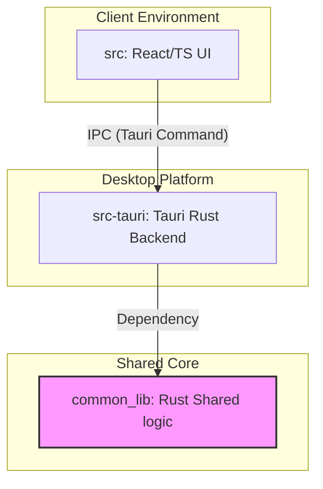
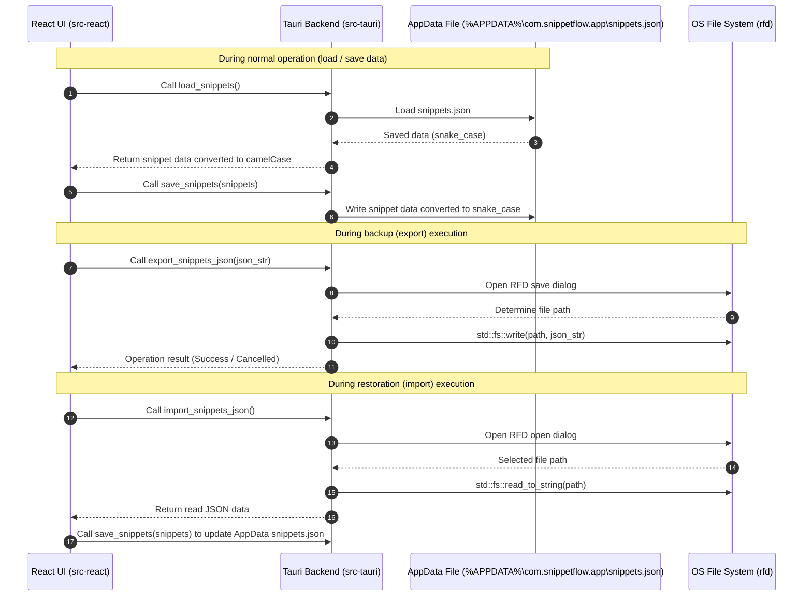

**English** | [日本語版](../ja/ARCHITECTURE.md)

# System Architecture Design Document (ARCHITECTURE.md)

This document defines the system structure, design philosophy in the hybrid execution environment, boundaries between components, and data flow / persistence design for the "Snippet Clipboard Manager (SnippetFlow)".

---

## 1. System Overview and Purpose

### 1.1. Overview
SnippetFlow is an ultra-lightweight desktop utility that safely stores canned texts (greetings, scheduling, apologies, PR templates, etc.) frequently used in daily business emails and routine operations in the local environment, and allows users to instantly recall and copy them to the clipboard when needed.

### 1.2. Purpose
- **Operational Efficiency**: Select, combine, and compare snippets with a few clicks or shortcut keys, and paste them into any application via the clipboard.
- **Ensuring Data Privacy**: Store all snippet data and configuration information only on the user's local disk without going through any cloud server.
- **Pursuing Low-Resource Operation**: Assume background execution at all times, achieving native operation with extremely low CPU and memory consumption.

---

## 2. Technology Stack

This project adopts a hybrid configuration to use the right technology for the right job.

### 2.1. Core Languages
- **Rust**: High performance, memory safety, and low resource footprint for desktop backend services.
- **TypeScript / JavaScript**: Ensuring rich frontend UI logic, safety, and modern user experience.

### 2.2. Frameworks & Libraries
| Category               | Tauri Desktop Version (Production)         | Web Version (Prototype / UI Verification) |
| :--------------------- | :----------------------------------------- | :---------------------------------------- |
| **GUI Framework**      | **Tauri v2** + **Vite 6** + **React 19**   | **Vite 6** + **React 19**                 |
| **Language / Runtime** | TS (React) / Rust (Tauri Backend)          | TS (React) / Browser Runtime              |
| **Styling**            | TailwindCSS v4 / Vanilla CSS               | TailwindCSS v4 / Vanilla CSS              |
| **Data Persistence**   | Encrypted JSON file in `%APPDATA%`         | Browser `localStorage`                    |
| **Clipboard I/O**      | `navigator.clipboard` / Tauri API          | `navigator.clipboard`                     |
| **Serialization**      | `serde` (v1.0) / `serde_json` (v1.0)       | `JSON.stringify` / `parse`                |
| **Dialog I/O**         | `rfd` (v0.12) mediated on Tauri Rust side  | Browser standard Download / Input File API|
| **Icons**              | `lucide-react`                             | `lucide-react`                            |

---

## 3. Architecture & Directory Structure Design Intent

The project is organized as follows, designed to leverage the productivity of Web technologies and the high performance and low footprint of Rust.

```text
SnippetFlow/
├── .agents/             # Agent instructions (AGENTS.md, etc.)
├── common_lib/          # Shared Rust library
├── docs/                # Specifications, architecture, release procedures, and other documents
├── src/                 # Frontend (React/TypeScript) source code for the Tauri version
└── src-tauri/           # Desktop app backend (Rust) source code for the Tauri version
```

### 3.1. Roles and Details of Each Directory
- **`src/` (Vite / React UI)**:
  - Responsible for providing rich UI expressions, smooth animations, and a comfortable UX.
  - Components representing each screen (list, form, merge, comparison, performance diagnostics) are modularized in `components/`, and state management is centralized in the custom hook `hooks/useSnippets.ts`.
- **`src-tauri/` (Tauri Rust Backend)**:
  - Serves as a native backend to safely and quickly execute OS-specific functions (such as import/export using native file dialogs) and heavy logic (diff computation, search & sorting, tag suggestions, encrypted storage, and high-speed mock data generation).
  - **Modular Architecture**:
    - `lib.rs`: Tauri entry point, single-instance plugin initialization, command routing registry.
    - `models.rs`: Data schema definitions for snippets and statistics, Serde serialization/deserialization, and conversion traits.
    - `storage.rs`: Atomic file I/O to AppData, encryption/decryption, OS-native dialog operations.
    - `operations.rs`: High-speed search & tag filtering, LCS text diffing, AI tag suggestions, snippet merging, mock data generation, statistics aggregation, and benchmark testing.
- **`common_lib/` (Shared Logic Crate)**:
  - Centralizes LCS difference calculation algorithms and encryption/decryption routines.

---

## 4. Data Flow and Inter-Module Collaboration

### 4.1. Module Configuration and Dependencies
The application dependencies are configured as follows, with `common_lib` containing the shared algorithms at its core.


```mermaid
graph TD
    subgraph Client Environment
        A[src: React/TS UI]
    end

    subgraph Desktop Platform
        C[src-tauri: Tauri Rust Backend]
    end

    subgraph Shared Core
        D[common_lib: Rust Shared logic]
    end

    A -- "IPC (Tauri Command)" --> C
    C -- "Dependency" --> D

    style D fill:#f9f,stroke:#333,stroke-width:2px
```

### 4.2. Tauri Version (React/TS + Rust) Data Flow
In the Tauri version, the `load_snippets` command of the Rust backend is invoked via Tauri's IPC (Tauri Command) at startup to load data from `%APPDATA%\com.snippetflow.app\snippets.json` (resolved via `app_data_dir()`).
Similarly, when saving data, the Rust backend writes to that fixed path through the `save_snippets` command. This path remains stable across version upgrades and reinstalls, preventing data loss.
Persistence of theme settings is currently completed within the browser's `localStorage` (planned to be centralized in `settings.json` in the future).


```mermaid
sequenceDiagram
    autonumber
    participant UI as React UI (src-react)
    participant Backend as Tauri Backend (src-tauri)
    participant File as AppData File (%APPDATA%\com.snippetflow.app\snippets.json)
    participant OS as OS File System (rfd)

    Note over UI, File: During normal operation (load / save data)
    UI->>Backend: Call load_snippets()
    Backend->>File: Load snippets.json
    File-->>Backend: Saved data (snake_case)
    Backend-->>UI: Return snippet data converted to camelCase
    
    UI->>Backend: Call save_snippets(snippets)
    Backend->>File: Write snippet data converted to snake_case

    Note over UI, OS: During backup (export) execution
    UI->>Backend: Call export_snippets_json(json_str)
    Backend->>OS: Open RFD save dialog
    OS-->>Backend: Determine file path
    Backend->>OS: std::fs::write(path, json_str)
    Backend-->>UI: Operation result (Success / Cancelled)

    Note over UI, OS: During restoration (import) execution
    UI->>Backend: Call import_snippets_json()
    Backend->>OS: Open RFD open dialog
    OS-->>Backend: Selected file path
    Backend->>OS: std::fs::read_to_string(path)
    Backend-->>UI: Return read JSON data
    UI->>Backend: Call save_snippets(snippets) to update AppData snippets.json
```

---

## 5. Shared Logic (`common_lib`) Algorithm Details

### 5.1. LCS (Longest Common Subsequence) Difference Calculation
`common_lib` contains the LCS algorithm, which is the core of the difference comparison feature. It compares Text A and Text B on a character-by-character or line-by-line basis to determine the longest common subsequence.
By building a Dynamic Programming (DP) table and backtracking from it, it detects added text (Green) and deleted text (Red) as minimal differences and returns them to the UI.

### 5.2. Intelligent Tag Proposal
When adding or editing a snippet, words contained in the input "title", "content", and "description" are categorized at the morpheme level (a process based on word frequency counts for lightweight execution), and their relevance to all tags in the existing database is calculated.
- **Calculation Formula**:
  For each existing tag, calculate the number of times the tag itself or its related keywords appear in the input text.
  $$Score = (TitleMatches \times 2) + ContentMatches + DescriptionMatches$$
  Among the tags whose scores are above a certain threshold, up to 5 tags that have not yet been assigned will be proposed.
