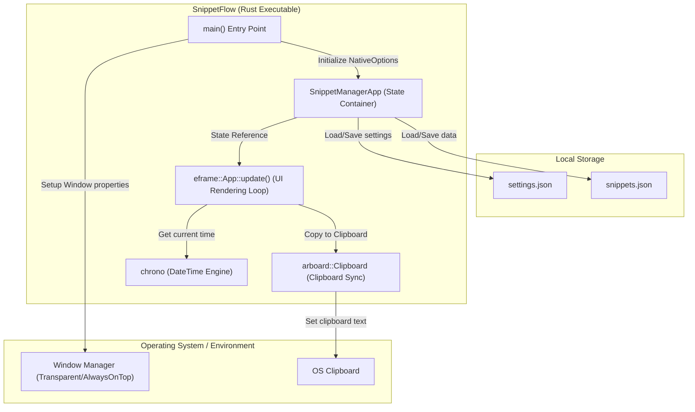
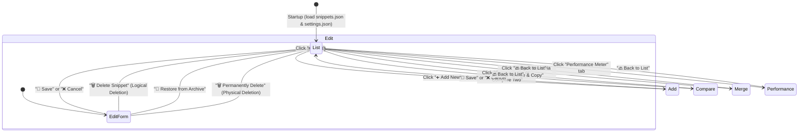
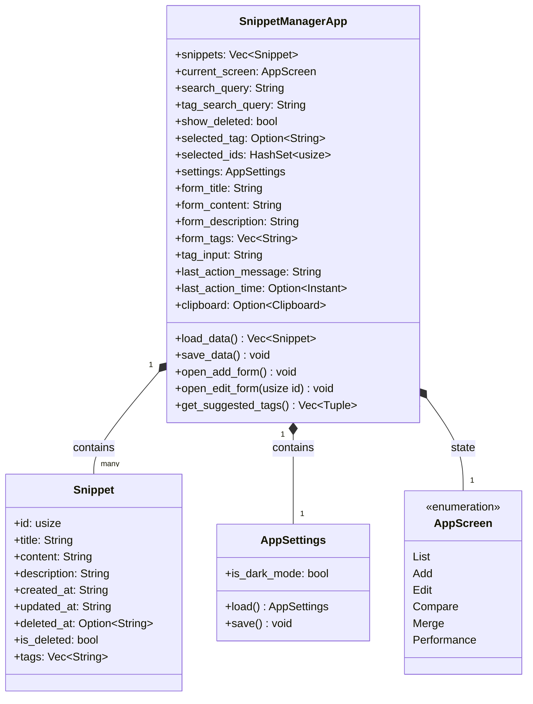
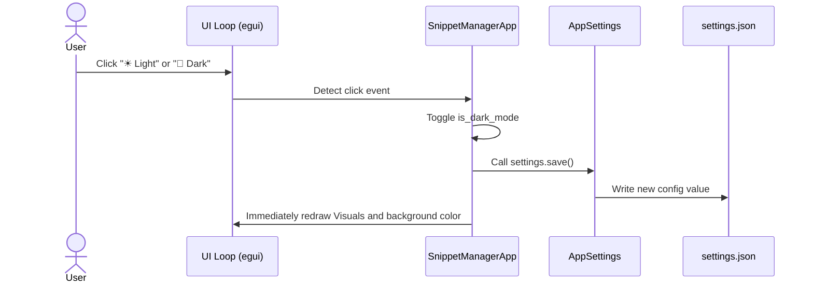
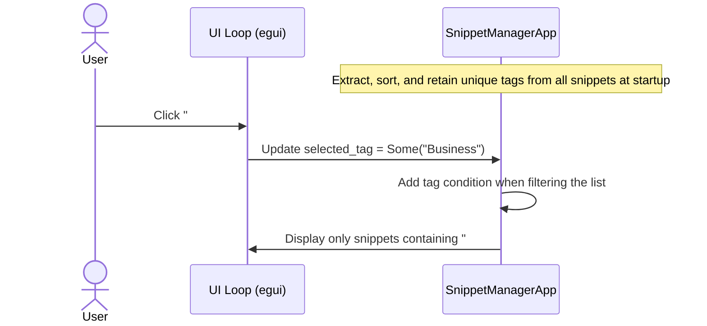
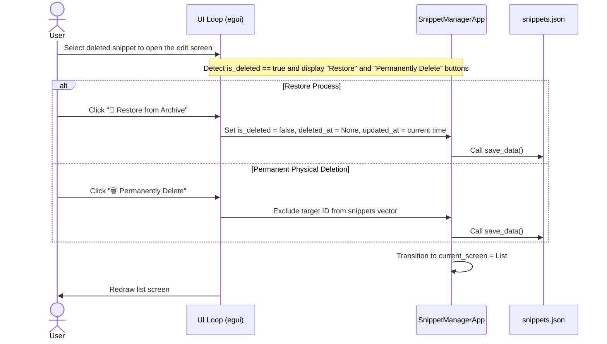

**English** | [日本語版](../ja/DIAGRAM.md)

# SnippetFlow (SnippetManager) System Architecture & Design Diagrams

This document visualizes the architecture, screen transitions, data structures, and representative use case data flows of **SnippetFlow** using Mermaid diagrams.

---

## 1. System Configuration & Component Structure

SnippetFlow runs in a single process, interacting directly with the OS native window API and clipboard API, and persisting data to local JSON storage (snippet data and application settings).

---

## 2. Screen Transition State Model (State Transition)

The application switches UI rendering based on the `AppScreen` state.

---

## 3. Data Structure Model

---

## 4. Sequence Flows

### 4.1. Theme Switching Persistence

The sequence from when the user clicks the "Toggle Theme" button on the UI until the rendering is updated and the setting is saved.

### 4.2. Tag Cloud Toggle Filtering

The sequence from when the user selects a specific tag in the tag cloud of the list screen until the snippet list is filtered.

### 4.3. Restoring Archived Data and Permanent Physical Deletion

The data flow for applying restoration or permanent deletion to deleted (archived) snippets.

