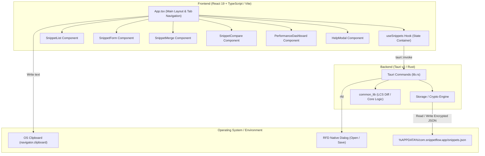
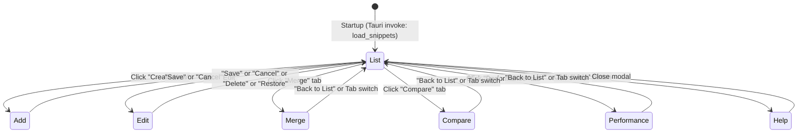
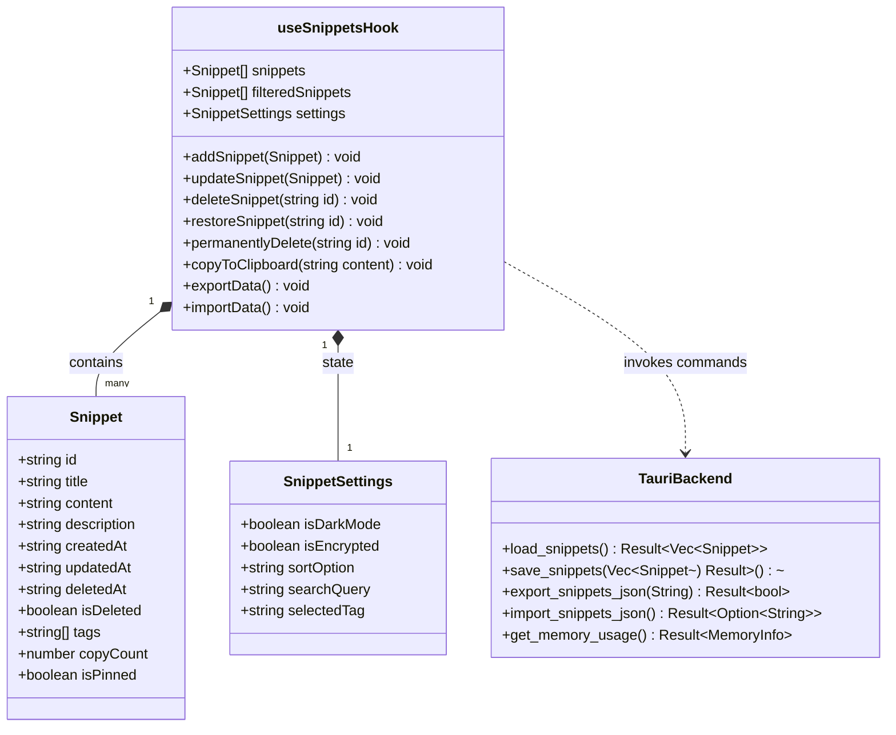
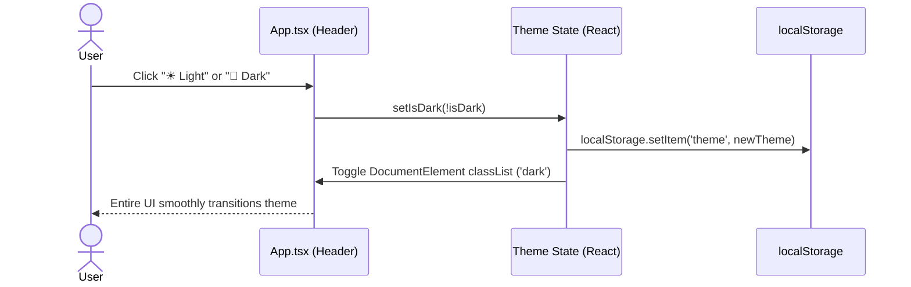
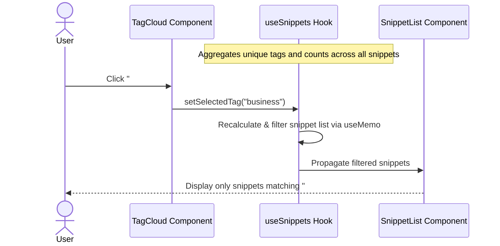
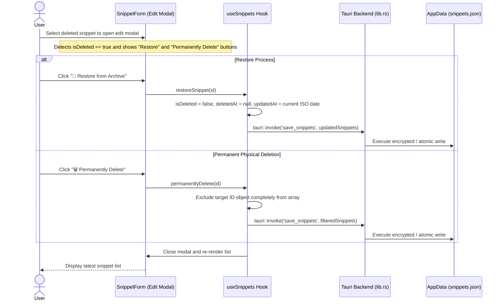

**English** | [日本語版](../ja/DIAGRAM.md)

# SnippetFlow System Architecture & Design Diagrams (DIAGRAM.md)

This document visualizes the architecture, screen transitions, data structures, and representative use case data flows of **SnippetFlow** using Mermaid diagrams.

---

## 1. System Configuration & Component Structure

SnippetFlow operates as a hybrid application combining a rich frontend powered by **React 19 + TypeScript** and a fast, secure system backend built with **Tauri v2 (Rust)**.

```mermaid
graph TD
    subgraph Frontend ["Frontend (React 19 + TypeScript / Vite)"]
        UI["App.tsx (Main Layout & Tab Navigation)"]
        Hook["useSnippets Hook (State Container)"]
        List["SnippetList Component"]
        Form["SnippetForm Component"]
        Merge["SnippetMerge Component"]
        Compare["SnippetCompare Component"]
        Stats["PerformanceDashboard Component"]
        Help["HelpModal Component"]
    end

    subgraph Backend ["Backend (Tauri v2 / Rust)"]
        Cmd["Tauri Commands (lib.rs)"]
        Storage["Storage / Crypto Engine"]
        CommonLib["common_lib (LCS Diff / Core Logic)"]
    end

    subgraph OS ["Operating System / Environment"]
        Clipboard["OS Clipboard (navigator.clipboard)"]
        Dialog["RFD Native Dialog (Open / Save)"]
        AppData["%APPDATA%/com.snippetflow.app/snippets.json"]
    end

    UI --> Hook
    UI --> List
    UI --> Form
    UI --> Merge
    UI --> Compare
    UI --> Stats
    UI --> Help

    Hook -->|tauri::invoke| Cmd
    Cmd --> Storage
    Cmd --> CommonLib
    Cmd -->|rfd| Dialog
    Storage -->|Read / Write Encrypted JSON| AppData
    UI -->|Write text| Clipboard
```

---

## 2. Screen Transition State Model (State Transition)

The application renders screens based on `currentTab` (along with edit/add modal states).

```mermaid
stateDiagram-v2
    [*] --> List : Startup (Tauri invoke: load_snippets)

    List --> Add : Click "Create New"
    List --> Edit : Click "Edit"
    List --> Merge : Click "Merge" tab
    List --> Compare : Click "Compare" tab
    List --> Performance : Click "Performance" tab
    List --> Help : Click "Help" button

    Add --> List : "Save" or "Cancel"
    Edit --> List : "Save" or "Cancel" or "Delete" or "Restore"
    
    Merge --> List : "Back to List" or Tab switch
    Compare --> List : "Back to List" or Tab switch
    Performance --> List : "Back to List" or Tab switch
    Help --> List : Close modal
```

---

## 3. Data Structure Model

```mermaid
classDiagram
    class Snippet {
        +string id
        +string title
        +string content
        +string description
        +string createdAt
        +string updatedAt
        +string deletedAt
        +boolean isDeleted
        +string[] tags
        +number copyCount
        +boolean isPinned
    }

    class SnippetSettings {
        +boolean isDarkMode
        +boolean isEncrypted
        +string sortOption
        +string searchQuery
        +string selectedTag
    }

    class TauriBackend {
        +load_snippets() Result~Vec~Snippet~~
        +save_snippets(Vec~Snippet~) Result~()~
        +export_snippets_json(String) Result~bool~
        +import_snippets_json() Result~Option~String~~
        +get_memory_usage() Result~MemoryInfo~
    }

    class useSnippetsHook {
        +Snippet[] snippets
        +Snippet[] filteredSnippets
        +SnippetSettings settings
        +addSnippet(Snippet) void
        +updateSnippet(Snippet) void
        +deleteSnippet(string id) void
        +restoreSnippet(string id) void
        +permanentlyDelete(string id) void
        +copyToClipboard(string content) void
        +exportData() void
        +importData() void
    }

    useSnippetsHook "1" *-- "many" Snippet : contains
    useSnippetsHook "1" *-- "1" SnippetSettings : state
    useSnippetsHook ..> TauriBackend : invokes commands
```

---

## 4. Sequence Flows

### 4.1. Theme Switching Persistence
Flow from clicking the theme switch button in the UI to re-rendering and persisting settings locally.

```mermaid
sequenceDiagram
    actor User
    participant UI as App.tsx (Header)
    participant State as Theme State (React)
    participant Storage as localStorage

    User->>UI: Click "☀ Light" or "🌙 Dark"
    UI->>State: setIsDark(!isDark)
    State->>Storage: localStorage.setItem('theme', newTheme)
    State->>UI: Toggle DocumentElement classList ('dark')
    UI-->>User: Entire UI smoothly transitions theme
```

### 4.2. Tag Cloud Filtering
Flow from selecting a specific tag in the tag cloud to filtering the snippet list.

```mermaid
sequenceDiagram
    actor User
    participant UI as TagCloud Component
    participant Hook as useSnippets Hook
    participant List as SnippetList Component

    Note over Hook: Aggregates unique tags and counts across all snippets
    User->>UI: Click "#business" tag button
    UI->>Hook: setSelectedTag("business")
    Hook->>Hook: Recalculate & filter snippet list via useMemo
    Hook->>List: Propagate filtered snippets
    List-->>User: Display only snippets matching "#business"
```

### 4.3. Restoring Archived Data & Permanent Deletion
Data flow for restoring or permanently deleting an archived snippet.

```mermaid
sequenceDiagram
    actor User
    participant UI as SnippetForm (Edit Modal)
    participant Hook as useSnippets Hook
    participant Backend as Tauri Backend (lib.rs)
    participant Storage as AppData (snippets.json)

    User->>UI: Select deleted snippet to open edit modal
    Note over UI: Detects isDeleted == true and shows "Restore" and "Permanently Delete" buttons
    
    alt Restore Process
        User->>UI: Click "🔄 Restore from Archive"
        UI->>Hook: restoreSnippet(id)
        Hook->>Hook: isDeleted = false, deletedAt = null, updatedAt = current ISO date
        Hook->>Backend: tauri::invoke('save_snippets', updatedSnippets)
        Backend->>Storage: Execute encrypted / atomic write
    else Permanent Physical Deletion
        User->>UI: Click "🗑️ Permanently Delete"
        UI->>Hook: permanentlyDelete(id)
        Hook->>Hook: Exclude target ID object completely from array
        Hook->>Backend: tauri::invoke('save_snippets', filteredSnippets)
        Backend->>Storage: Execute encrypted / atomic write
    end
    
    Hook->>UI: Close modal and re-render list
    UI-->>User: Display latest snippet list
```
