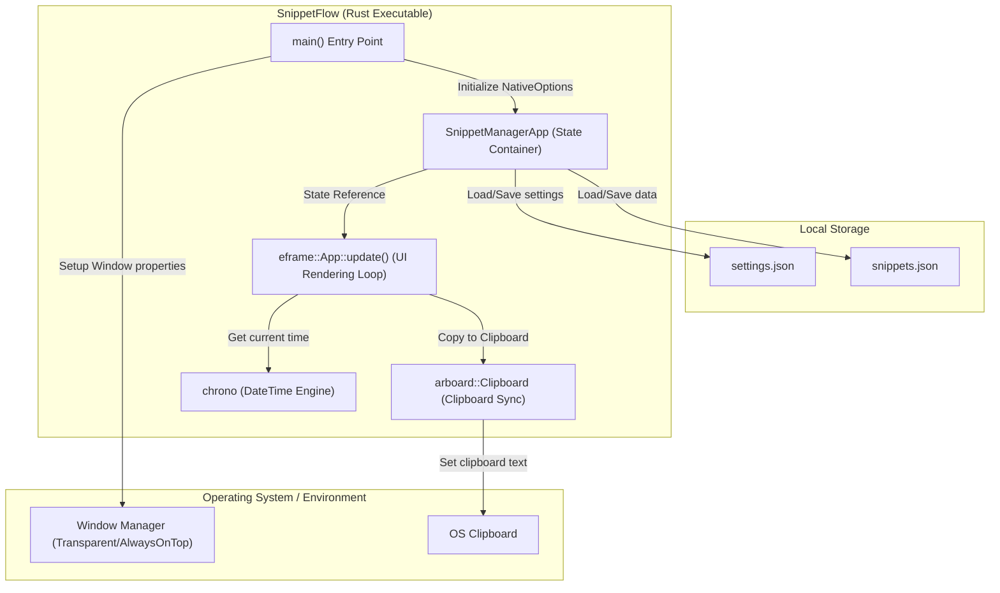
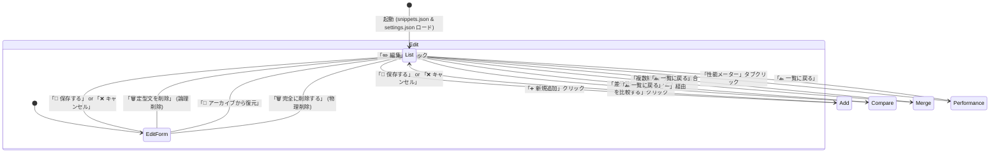
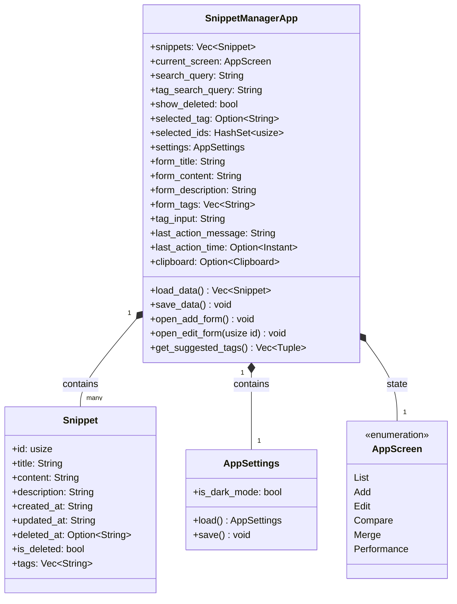
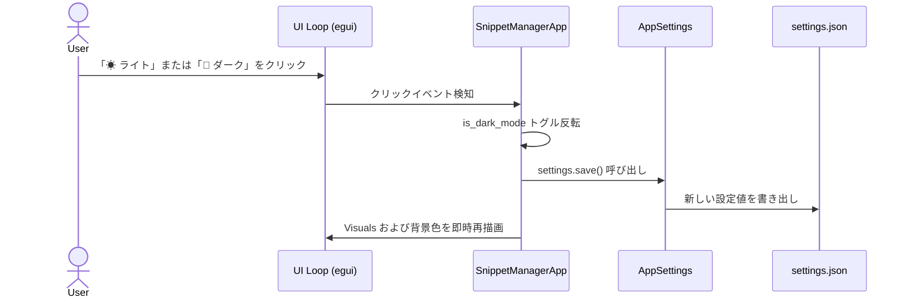
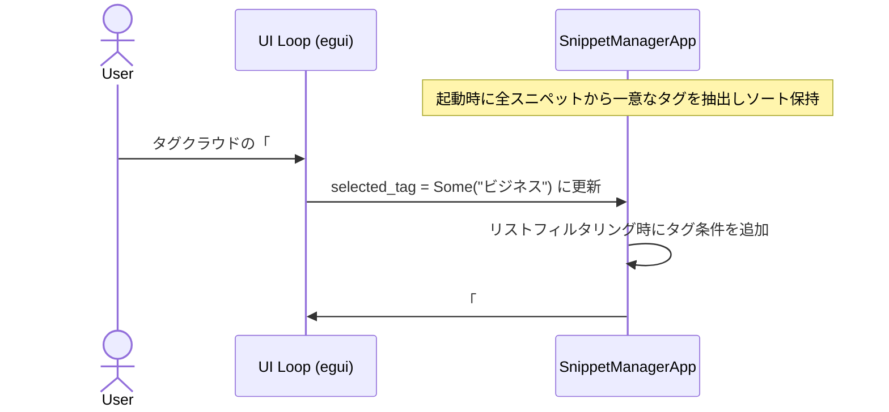
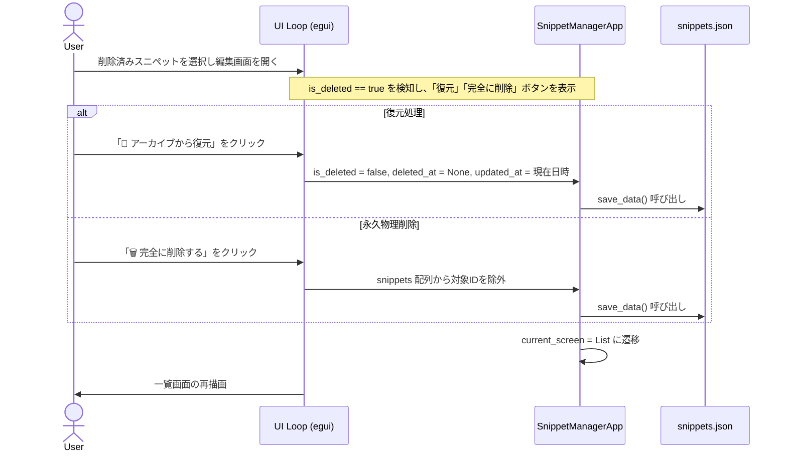

[English](../en/DIAGRAM.md) | **日本語版**

# SnippetFlow (SnippetManager) システム構成・設計図面

本ドキュメントでは、**SnippetFlow** のアーキテクチャ、画面遷移、データ構造、および代表的なユースケースのデータフローを Mermaid ダイアグラムで可視化します。

---

## 1. システム構成・コンポーネント構造

SnippetFlow は単一のプロセスで動作し、OSのネイティブウィンドウAPIおよびクリップボードAPIと直接やり取りを行い、ローカルのJSONストレージ（スニペットデータおよびアプリ設定）へデータを永続化します。

---

## 2. 画面遷移状態モデル (State Transition)

アプリケーションは `AppScreen` 状態に基づいてUI描画を切り替えます。

---

## 3. データ構造モデル

---

## 4. シーケンスフロー

### 4.1. テーマ切り替えの永続化
ユーザーがUI上で「テーマ切り替え」ボタンを押してから、描画が更新され設定が保存されるまでの流れです。

### 4.2. タグクラウドによるトグル絞り込み
ユーザーが一覧画面のタグクラウドで特定のタグを選択し、スニペット一覧がフィルタリングされる流れです。

### 4.3. アーカイブデータの復元と永久物理削除
削除済み（アーカイブ）スニペットに対して復元および永久削除を適用するデータフローです。

