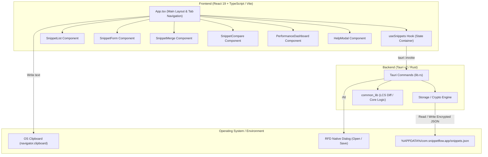
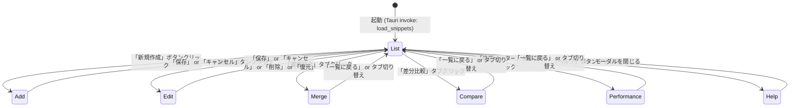
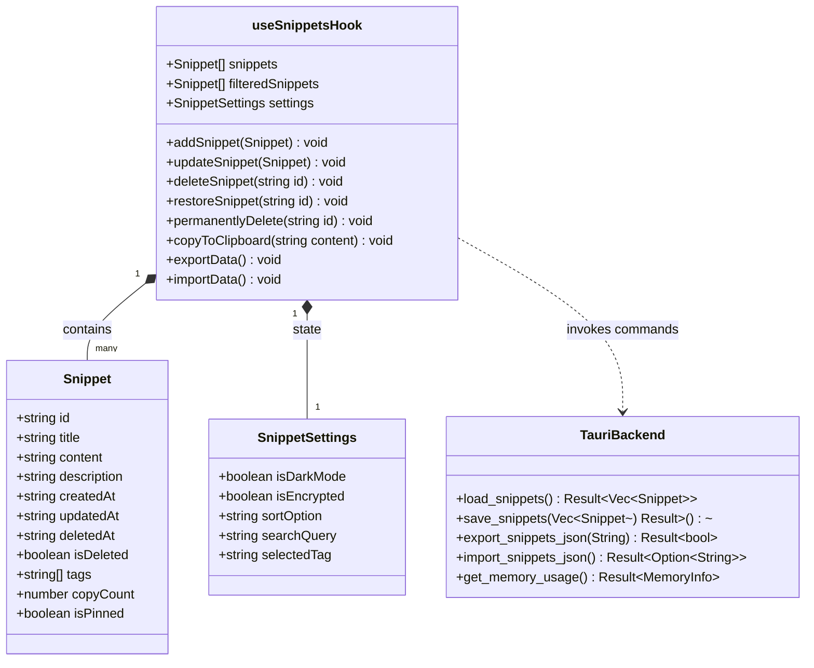
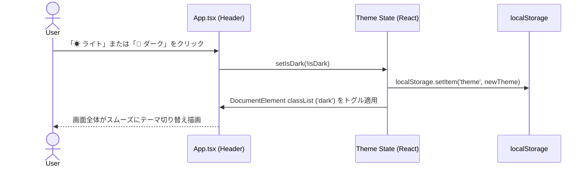
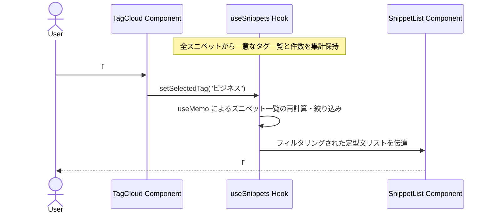
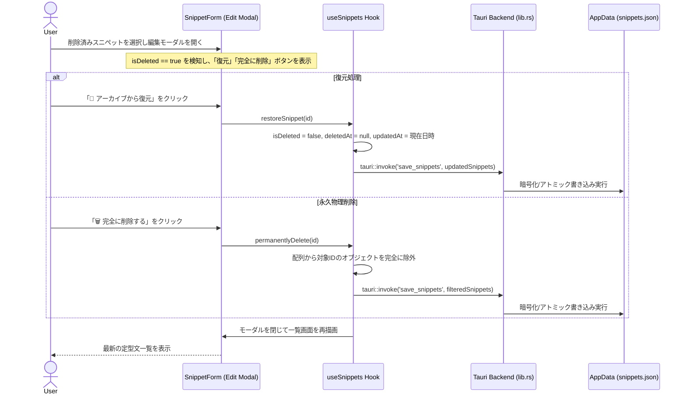

[English](../en/DIAGRAM.md) | **日本語版**

# SnippetFlow システム構成・設計図面 (DIAGRAM.md)

本ドキュメントでは、**SnippetFlow** のアーキテクチャ、画面遷移、データ構造、および代表的なユースケースのデータフローを Mermaid ダイアグラムで可視化します。

---

## 1. システム構成・コンポーネント構造

SnippetFlow は、**React 19 + TypeScript** によるリッチなフロントエンドと、**Tauri v2 (Rust)** による高速・安全なシステムバックエンドのハイブリッド構成で動作します。

```mermaid
graph TD
    subgraph Frontend ["Frontend (React 19 + TypeScript / Vite)"]
        UI["App.tsx (Main Layout & Tab Navigation)"]
        Hook["useSnippets Hook (State Container)"]
        List["SnippetList Component"]
        Form["SnippetForm Component"]
        Merge["SnippetMerge Component"]
        Compare["SnippetCompare Component"]
        Stats["PerformanceDashboard Component"]
        Help["HelpModal Component"]
    end

    subgraph Backend ["Backend (Tauri v2 / Rust)"]
        Cmd["Tauri Commands (lib.rs)"]
        Storage["Storage / Crypto Engine"]
        CommonLib["common_lib (LCS Diff / Core Logic)"]
    end

    subgraph OS ["Operating System / Environment"]
        Clipboard["OS Clipboard (navigator.clipboard)"]
        Dialog["RFD Native Dialog (Open / Save)"]
        AppData["%APPDATA%/com.snippetflow.app/snippets.json"]
    end

    UI --> Hook
    UI --> List
    UI --> Form
    UI --> Merge
    UI --> Compare
    UI --> Stats
    UI --> Help

    Hook -->|tauri::invoke| Cmd
    Cmd --> Storage
    Cmd --> CommonLib
    Cmd -->|rfd| Dialog
    Storage -->|Read / Write Encrypted JSON| AppData
    UI -->|Write text| Clipboard
```

---

## 2. 画面遷移状態モデル (State Transition)

アプリケーションは `currentTab`（および編集/追加モーダル状態）に基づいて画面を描画します。

```mermaid
stateDiagram-v2
    [*] --> List : 起動 (Tauri invoke: load_snippets)

    List --> Add : 「新規作成」ボタンクリック
    List --> Edit : 「編集」ボタンクリック
    List --> Merge : 「複数結合」タブクリック
    List --> Compare : 「差分比較」タブクリック
    List --> Performance : 「性能メーター」タブクリック
    List --> Help : 「ヘルプ」ボタンクリック

    Add --> List : 「保存」 or 「キャンセル」
    Edit --> List : 「保存」 or 「キャンセル」 or 「削除」 or 「復元」
    
    Merge --> List : 「一覧に戻る」 or タブ切り替え
    Compare --> List : 「一覧に戻る」 or タブ切り替え
    Performance --> List : 「一覧に戻る」 or タブ切り替え
    Help --> List : モーダルを閉じる
```

---

## 3. データ構造モデル

```mermaid
classDiagram
    class Snippet {
        +string id
        +string title
        +string content
        +string description
        +string createdAt
        +string updatedAt
        +string deletedAt
        +boolean isDeleted
        +string[] tags
        +number copyCount
        +boolean isPinned
    }

    class SnippetSettings {
        +boolean isDarkMode
        +boolean isEncrypted
        +string sortOption
        +string searchQuery
        +string selectedTag
    }

    class TauriBackend {
        +load_snippets() Result~Vec~Snippet~~
        +save_snippets(Vec~Snippet~) Result~()~
        +export_snippets_json(String) Result~bool~
        +import_snippets_json() Result~Option~String~~
        +get_memory_usage() Result~MemoryInfo~
    }

    class useSnippetsHook {
        +Snippet[] snippets
        +Snippet[] filteredSnippets
        +SnippetSettings settings
        +addSnippet(Snippet) void
        +updateSnippet(Snippet) void
        +deleteSnippet(string id) void
        +restoreSnippet(string id) void
        +permanentlyDelete(string id) void
        +copyToClipboard(string content) void
        +exportData() void
        +importData() void
    }

    useSnippetsHook "1" *-- "many" Snippet : contains
    useSnippetsHook "1" *-- "1" SnippetSettings : state
    useSnippetsHook ..> TauriBackend : invokes commands
```

---

## 4. シーケンスフロー

### 4.1. テーマ切り替えの永続化
ユーザーがUI上で「テーマ切り替え」ボタンを押してから、描画が更新されローカルに設定が保存されるまでの流れです。

```mermaid
sequenceDiagram
    actor User
    participant UI as App.tsx (Header)
    participant State as Theme State (React)
    participant Storage as localStorage

    User->>UI: 「☀ ライト」または「🌙 ダーク」をクリック
    UI->>State: setIsDark(!isDark)
    State->>Storage: localStorage.setItem('theme', newTheme)
    State->>UI: DocumentElement classList ('dark') をトグル適用
    UI-->>User: 画面全体がスムーズにテーマ切り替え描画
```

### 4.2. タグクラウドによるトグル絞り込み
ユーザーが一覧画面のタグクラウドで特定のタグを選択し、スニペット一覧がフィルタリングされる流れです。

```mermaid
sequenceDiagram
    actor User
    participant UI as TagCloud Component
    participant Hook as useSnippets Hook
    participant List as SnippetList Component

    Note over Hook: 全スニペットから一意なタグ一覧と件数を集計保持
    User->>UI: 「#ビジネス」タグボタンをクリック
    UI->>Hook: setSelectedTag("ビジネス")
    Hook->>Hook: useMemo によるスニペット一覧の再計算・絞り込み
    Hook->>List: フィルタリングされた定型文リストを伝達
    List-->>User: 「#ビジネス」を含むスニペットのみを表示
```

### 4.3. アーカイブデータの復元と永久物理削除
削除済み（アーカイブ）スニペットに対して復元および永久削除を適用するデータフローです。

```mermaid
sequenceDiagram
    actor User
    participant UI as SnippetForm (Edit Modal)
    participant Hook as useSnippets Hook
    participant Backend as Tauri Backend (lib.rs)
    participant Storage as AppData (snippets.json)

    User->>UI: 削除済みスニペットを選択し編集モーダルを開く
    Note over UI: isDeleted == true を検知し、「復元」「完全に削除」ボタンを表示
    
    alt 復元処理
        User->>UI: 「🔄 アーカイブから復元」をクリック
        UI->>Hook: restoreSnippet(id)
        Hook->>Hook: isDeleted = false, deletedAt = null, updatedAt = 現在日時
        Hook->>Backend: tauri::invoke('save_snippets', updatedSnippets)
        Backend->>Storage: 暗号化/アトミック書き込み実行
    else 永久物理削除
        User->>UI: 「🗑️ 完全に削除する」をクリック
        UI->>Hook: permanentlyDelete(id)
        Hook->>Hook: 配列から対象IDのオブジェクトを完全に除外
        Hook->>Backend: tauri::invoke('save_snippets', filteredSnippets)
        Backend->>Storage: 暗号化/アトミック書き込み実行
    end
    
    Hook->>UI: モーダルを閉じて一覧画面を再描画
    UI-->>User: 最新の定型文一覧を表示
```

